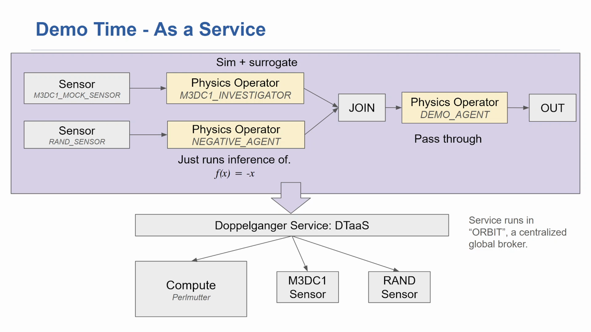
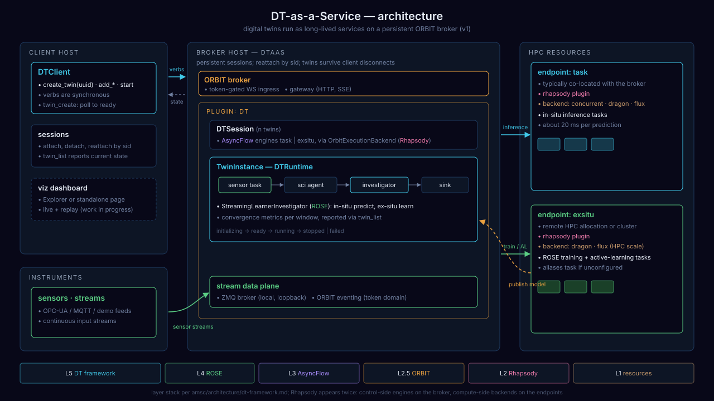

# Digital Twin as a Service (DTaaS): demo

DTaaS runs digital twins as long-lived services. A client submits a
twin description (sensors, physics operators, inference tasks); the
service places the work on HPC resources, keeps the twin running after
the client disconnects, and hides where and how each part runs.

## Demo video (3:40)

Click the image to play. The first two minutes introduce DTaaS and the
demo twin; the rest shows the live run.

**The twin.** Two sensors feed two physics operators. The M3DC1 mock
sensor drives an M3DC1 investigator that trains two surrogate models
in situ and serves the better one. A random-value sensor drives an
inference-only operator computing `f(x) = -x`. A join merges both
prediction streams into a pass-through agent and an output sink.

**The deployment.** The ORBIT broker with the DT service plugin runs on a
standalone host. Compute is a Rhapsody endpoint on a Perlmutter
allocation, launched with Dragon. Sensors and the client run on the
user's machine and reach the service through one outbound connection.

**What you see.** Broker and endpoint start and register. The client
script builds the twin graph from the description above, starts it,
and polls its state and predictions. Surrogate training and inference
tasks land on Perlmutter. The client closes the twin and the service
returns to empty.

## Architecture

The DT framework is a thin top layer; ROSE (active learning), AsyncFlow,
ORBIT and Rhapsody below it exist and run today. Details:
[architecture/dt-framework.md](architecture/dt-framework.md).

## Reproduce

- [use-cases/dt-complete](use-cases/dt-complete): the demo twin
  (`run_me_service.py`, sensors, operators).
- [use-cases/dt-complete/deploy](use-cases/dt-complete/deploy): broker,
  HPC endpoint and client setup, pinned to one framework commit.
- [radical-cybertools/digital.twins](https://github.com/radical-cybertools/digital.twins):
  the framework and the DT service plugin.

## Questions

Open an issue in this repository.
