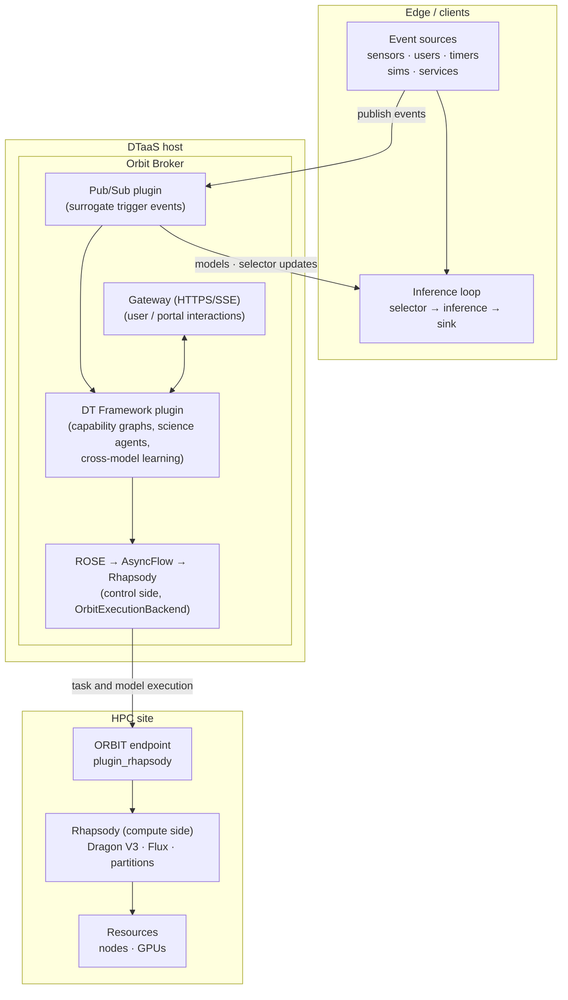

# Digital Twin Framework — Architecture

**Status:** draft for discussion.
**Background reading:** `High_Level_DT_Framework.pptx`,
`Digital_Twin_Design_Doc.pdf`.
**Diagrams:** `diagrams/` — lifecycle and sequence diagrams (PlantUML
sources + rendered SVGs).

This document describes the architecture of the Digital Twin Framework:
its components, their responsibilities and interfaces, their realization
on the RADICAL software stack (ROSE, AsyncFlow, Rhapsody, ORBIT), and the
software pieces which do not exist yet (§4). It is the precursor to a
formal (YAML/JSON) specification. The architecture is use-case
independent: it assumes no particular science domain, kind of event
source, evaluation criterion, or site topology.

---

## 1. Terminology

- A **digital twin (DT)** is a continuously updated computational
  counterpart of a physical or experimental system: concretely, a running
  capability graph (§3.6) whose models keep learning against reality while
  serving inference.
- A **surrogate model** (short: **surrogate**) is a trained model which
  stands in for an expensive simulation or experiment for a given
  capability, and which is cheap enough to evaluate inside inference and
  control loops. The models a DT learns and serves are surrogates.
- A **capability** is a typed input → output contract (e.g. *plasma
  diagnostic signals → equilibrium reconstruction*, or *CAT scan image →
  cancer detection*). Capabilities are the unit of composition: a digital
  twin is a graph of capabilities, not of models.
- A **model architecture** is one way to realize a capability (FNO, PCR,
  LSTM, a numerical simulation, …).
- A **model investigator** owns one (architecture × capability) pair and
  improves it continuously via a **learner loop**: simulation, training,
  and active-learning-policy tasks.
- A **science agent** owns one capability. It contains all model
  investigators for that capability plus one **cross-model learner** which
  compares them and maintains the capability's **model selector**: the
  policy which tells the inference side what model (or blend) to use.
- An **event source** triggers activity in the graph: an instrument or
  sensor stream, a user interaction, a timed trigger, output of a running
  simulation or campaign, or any external service which publishes events.
  All of these act as publishers on the pub/sub plane; downstream
  components do not depend on the kind of source.
- The **inference loop** is the serving-side counterpart: it consumes
  events, applies the selector, runs inference, and feeds sinks and
  actuators. It runs indefinitely, often — not necessarily — at the edge,
  near sources and actuators. Learner loops are separate loops: they run
  until their objective is met (and may adjust that objective).

---

## 2. Layer architecture

### 2.1 The stack

The DT Framework is the top layer of the RADICAL stack:

```
L5 DT Framework → L4 ROSE → L3 AsyncFlow → L2.5 ORBIT → L2 Rhapsody → L1 resources
```

Two properties of the actual software refine that picture:

1. **Rhapsody appears twice.** The control side uses Rhapsody's
   `OrbitExecutionBackend` (the loop runs anywhere and dials the broker);
   the compute side runs a second Rhapsody instance (Dragon V3 / Flux
   backends) inside the HPC allocation, exposed by the ORBIT endpoint's
   `plugin_rhapsody`.
2. **ORBIT plays a dual role.** It is an execution layer *underneath* the
   control-side Rhapsody (it proxies the Session/Task API over the
   broker), and its endpoint in turn *uses* Rhapsody and its Dragon
   execution layer for task execution. The broker-hosted `task_dispatcher`
   plugin additionally sits *above* endpoints when it provisions pilots
   and routes tasks across pools.

**Rhapsody-as-a-Service (RaaS)** names that arrangement: a Rhapsody
instance inside an allocation, kept available behind an ORBIT endpoint for
remote clients. **ROSE-aaS is ROSE using RaaS**: ROSE remains a
client-side library; the service property comes from the Rhapsody/ORBIT
layers below.

### 2.2 Where the control plane runs — DT-as-a-service

The control plane (DT framework, ROSE, AsyncFlow, control-side Rhapsody)
is **placement-agnostic**: it speaks the ORBIT participant protocol
wherever it runs. Two deployment profiles:

| Profile | Control plane runs | Role |
|---|---|---|
| Interactive | user's laptop or a service host | development, debugging, ad-hoc runs |
| **Broker-hosted** | as an ORBIT broker plugin on the broker's plugin host | **the managed offering: DT-as-a-service** |

**Broker-hosted is the managed DT offering (DTaaS) in the AmSC context.**
A digital twin is long-running: the inference loop runs indefinitely, the
learner loops span many allocations. The control loop should therefore
not be bound to an interactive user session; broker-hosting gives the
twin the broker's lifetime and reachability. ORBIT's `task_dispatcher`
already implements that pattern — a broker-hosted control loop which
drives `RhapsodyClient`/`PSIJClient` through the in-process caller.
Additional benefits:

- the gateway's HTTP/SSE surface lets users submit and monitor DT graphs
  without being ORBIT participants (the hook for an AmSC portal);
- co-location with a broker-backed pub/sub (§3.4, G1b): science agents
  subscribe without network hops.

One broker hosts many twins: a DT instance maps onto an ORBIT session
(plugins are session-scoped already), so isolation and cleanup ride the
session lifecycle — no broker instance per twin, which would mean a
process, port, cert, and socket set each. Each DT control loop runs in
its own worker process under the plugin host; scheduling is the OS's.
The client acts as a console: attach to the running twin, tweak
parameters, detach. Open engineering items: control-plane dependencies
on the broker host; the process-per-session worker model (G11). The
interactive profile remains the dev/debug mode of the same, unchanged
control plane.

The figure shows the broker-hosted (DTaaS) profile. Top to bottom: the
edge, the broker, and one HPC site. In the interactive profile the DT
plugin moves out of the broker onto a user host and connects like any
other participant; nothing else changes.



Notes:

- Control traffic flows through the ORBIT broker; **bulk data moves out of
  band** (shared FS, Globus, SSH tunnels). That is an ORBIT invariant and
  the DT design keeps it (see §3.7).
- The pub/sub component connects the inference loop with the science
  agents. It is a communication plane of its own, not an execution layer;
  the broker-hosted plugin is one backend option (see §3.4).

---

## 3. Components

Each subsection covers responsibility, interfaces, mapping to existing
software, and what is missing. Interface descriptions are informal; they
are written to become sections of the formal spec.

### 3.1 Learner loop (per model investigator)

**Responsibility**

Improve one (architecture × capability) model: iterate simulation →
training → active-learning policy until the stop criterion is met; keep
per-iteration state durable.

**Interfaces**

- In: task definitions (sim / train / AL policy — user functions or shell
  commands); learner config (iteration bounds plus an open-ended stop
  criterion: metric threshold, budget, wall-time, or an external
  decision); execution backend handle.
- Out: stream of per-iteration state (criterion value and history,
  should-stop, registered domain state); trained model artifacts;
  tracking events.

**Mapping**

This exists — it is ROSE's core:

- `rose.learner.Learner` + `IterationState` / `LearnerConfig`: the loop
  is an async generator (`async for state in learner.start(...)`), so an
  external decision maker — code, human, or agent — can observe each
  iteration and steer. The cross-model learner (§3.3) uses that hook. It
  also keeps stop criteria open: the criterion is a user-supplied task,
  not a hard-coded metric check.
- Loop families: `rose.al` (`SequentialActiveLearner`,
  `ParallelActiveLearner`), `rose.rl`, `rose.uq`; metrics in
  `rose.metrics`; experiment tracking via `rose.tracking` with
  MLflow/ClearML integrations (merged to `main`).
- Task registration by decorator (`@simulation_task`, `@training_task`,
  `@active_learn_task`) today; declaratively via the YAML spec
  (`rose/spec/`: schema, builder, adapters) on branch `feature/yaml-spec`.

**Missing**

Nothing structural, two consumability items:

- the YAML-spec and RaaS branches are not on ROSE `main` yet;
- "policy" as a first-class task name (pptx: *policy, sim, train*) maps
  onto the AL-policy task — a naming alignment for the spec, no new code.

### 3.2 Model investigator

**Responsibility**

The complete (architecture × capability) unit: a wrapper around the
learner loop (§3.1), the inference task (§3.5), and the learner-side
callbacks through which the loop reacts to edge events (new data, drift,
restart); plus the model artifact lineage.

**Mapping**

A thin wrapper, mostly exists: a model investigator is a ROSE learner
instance plus metadata (`arch`, `capability`) plus an inference-task
handle plus a model-artifact pointer. `ParallelActiveLearner` already
orchestrates N independent learner instances concurrently, but for N
learners of the *same* architecture (ensembles).

**Missing**

- the investigator abstraction itself: (arch, capability) identity,
  registry lineage, inference-task handle, and learner-side callback
  registration wrapped around a learner instance. Small; home is the DT
  layer.

### 3.3 Science agent and cross-model learner

**Responsibility**

One science agent per capability. It runs all model investigators for
that capability concurrently; its cross-model learner:

- compares investigators on pluggable evaluation criteria — accuracy on
  shared validation data, cost/latency, UQ quality, human or agent
  judgment, in any combination;
- maintains and publishes the **model selector**;
- may reallocate effort between investigators (stop an architecture,
  spawn a new one).

**Interfaces**

- In: the capability's input stream (subscription); the member
  investigators' iteration-state streams and evaluation results.
- Out: `ModelSelector` messages on the pub/sub channel (capability id →
  {architecture/model version → weight or argmax choice}); model
  artifacts to the registry; agent-level health and progress events.

**Mapping**

Partial:

- concurrent multi-learner execution: `rose.al.ParallelActiveLearner`
  (same-arch today);
- model comparison and selection ingredients: `rose.al.selector`,
  `rose.metrics`, and ROSE's stated goal of "selection of the best
  surrogate model based on performance metrics";
- observation hook: the `IterationState` async-generator protocol (§3.1).

**Missing**

The main new piece of the DT layer:

- *cross-architecture* comparison: current parallel learners assume one
  architecture; metrics need normalization across heterogeneous
  investigators (different costs, different convergence);
- the model selector as a published artifact: schema, versioning, and the
  publish path to the inference loop — neither ROSE nor ORBIT has this
  today;
- effort reallocation across investigators (v2; a static investigator set
  is fine for v1).

Placement: the DT layer defines the cross-model learner as an abstract
component — consume the investigators' iteration state and evaluation
results, emit a selector — with pluggable implementations. A ROSE-based
reference implementation reuses ROSE's loop, metric, and tracking
machinery, but the DT core does not depend on ROSE; investigators need
not be ROSE learners, any loop which reports evaluations fits. The
science agent (stream subscription, selector publication, lifecycle)
lives in the DT layer as well.

### 3.4 Pub/sub component (edge streaming)

**Responsibility**

Connect the two concurrent flows: trigger events from event sources to
subscribed science agents; model and selector updates from agents back to
inference loops. Fan-out, replay for late joiners, and delivery
acknowledgment for control-relevant messages (selector updates must not
be silently lost).

**Interfaces**

- Frontend (the stable surface): an abstract communicator class —
  `publish(channel, msg)`, `subscribe(channel, callback)`, channels
  namespaced per capability graph instance. It pins the *semantics*
  (replay, ack, ordering), not just the API shape. Message classes:
  `TriggerEvent` (any source kind: sensor reading, user action, timer,
  sim/campaign milestone), `ModelPublished`, `SelectorUpdate`, plus
  opaque app payloads.
- Backend: transport adapters (ORBIT, Redis, MQTT, ZMQ, in-process)
  behind the frontend; DT code never imports a transport.

**Mapping**

| Option | What exists | Fit |
|---|---|---|
| **ORBIT broker as backend** (recommended target) | Broker routes `event` frames between participants, tracks liveness; every DOE-site endpoint reaches it over a single outbound WSS, so the firewall problem is solved | Best alignment; needs an explicit pub/sub plugin (channel registry, fan-out, replay buffer) — today's events are point-to-point notifications, not channels |
| Managed Redis **Streams** (not pub/sub) | Streams give persistence, ack, and replay; raw Redis pub/sub is fire-and-forget and breaks ORBIT's liveness invariant | Good semantics; raw TCP 6379 egress is unverified at OLCF/ALCF (443/proxy-only risk) — a WSS-speaking middle may be required at DOE sites |
| Kafka / MQTT / NATS | Standard ecosystem | Heavyweight (Kafka) or weaker semantics (MQTT QoS vs replay); one more service to operate at or near the edge; no DOE-egress advantage |

**Missing**

- the frontend: abstract communicator, message classes, callback
  registration, plus a simple dev adapter (in-process or local Redis) —
  most other new pieces build on this (G1a);
- the ORBIT backend adapter: channel registry, fan-out, replay buffer —
  needed once runs go multi-site or managed (G1b);
- it should be its own package, frontend and backends separated, and
  stay out of ROSE to keep the layering clean.

### 3.5 Inference task and edge callbacks

**Responsibility**

- Inference task: a long-running serving task which hosts the currently
  selected model(s) for a capability and answers inference requests — on
  the edge, on HPC near the data, or both.
- Callbacks: user hooks fired on pub/sub events, at two sites —
  learner-side, owned by the investigator (§3.2), reacting to edge events
  (new data, drift, loop restart); edge-side, registered on the pub/sub
  frontend by the inference loop, e.g. hot-swap on `SelectorUpdate`.

**Mapping**

- Rhapsody runs services alongside tasks — that is its defining
  capability. A persistent inference task is a Rhapsody service task; for
  HPC-side inference this is configuration, not new machinery.
- Model registry and artifact exchange: MLflow is deployed in the AmSC
  context (`use-cases/AMSC-MLFLOW-SETUP.md`) and ROSE has an MLflow
  tracker. "Publish new models" leans on that registry: publish the
  *reference* on the channel, move the *bytes* out of band (§2.2 notes).
- Edge-side callbacks have no RADICAL home today; they belong to the
  pub/sub frontend (§3.4), which the edge process embeds.

**Missing**

- an inference-task template (load model ref → serve → watch
  `SelectorUpdate` → reload) as a reusable ROSE/DT task type;
- the callback registration API on the pub/sub frontend;
- a `ModelPublished` message which carries a registry reference rather
  than weights.

### 3.6 Capability graph, workflow builder, stream resolver

**Responsibility**

The digital twin itself: a typed graph whose nodes are science agents,
event sources, sinks, pre-existing tasks (existing sims and models
wrapped as capabilities), and utility nodes (SPLIT, AGGREGATE); whose
edges are streams. The **builder** instantiates the graph (spawns agents,
wires subscriptions); the **stream resolver** turns graph edges into
concrete pub/sub channels and validates type compatibility of chained
capabilities.

**Interfaces**

- In: a declarative graph description (the future formal spec — YAML,
  extending the `rose/spec` schema/builder/adapter pattern).
- Out: running science agents (each a ROSE/AsyncFlow workflow on some
  execution backend); a channel plan; a graph-level status and health
  view.

**Mapping**

Greenfield, but the substrate exists:

- `rose/spec` (branch `feature/yaml-spec`) does declarative → builder →
  running learner for a *single* loop; the capability graph is the same
  pattern one level up and should extend that schema rather than invent a
  second spec language.
- Graph execution needs no new engine: each science agent is an AsyncFlow
  workflow; concurrency across agents is concurrent workflows on shared
  backends. Placement across sites and pools is ORBIT `task_dispatcher`
  territory.

**Missing**

- graph schema: node and edge types, SPLIT/AGGREGATE semantics;
- builder and stream resolver;
- a wrapper which turns a pre-existing sim or model into a graph node (a
  capability with a degenerate science agent: no learner, fixed model).

### 3.7 Data movement

**Responsibility**

Get simulation outputs to training, training artifacts to the registry,
and streamed data to where learner loops run.

**Mapping**

Not automated by ROSE today: task code owns data movement. Available
out-of-band mechanisms: shared FS within an allocation, ORBIT `staging`
plugin, Globus (`plugin_globus`), SSH tunnels. The pub/sub channel must
not become the data path — control messages and references only (§2.2
notes).

**Missing**

- not solved in this design either. The formal spec should make data
  locality *declarable* per graph edge (what FS or namespace a stream's
  bulk payload lives in), so the builder can at least validate
  reachability. Open design item, not a first deliverable.

---

## 4. Gap register

Concrete missing pieces in build order, grouped in four phases:
foundations → agents → graph → service. "New (DT)" = the new L5 package.

| # | Phase | Piece | What exists today | What's missing | Home |
|---|-------|-------|-------------------|----------------|------|
| G9 | foundations | Merge consumability | `feature/yaml-spec`, `prototype/raas` branches | Land spec + RaaS work on ROSE `main` | ROSE |
| G5 | foundations | Model investigator abstraction | ROSE learner instances | (arch × capability) identity, registry lineage, inference-task handle, learner-side callbacks on a learner | New (DT) |
| G6 | foundations | Inference/serving task template | Rhapsody service tasks; MLflow registry | Load-serve-watch-reload template; `ModelPublished` carrying registry refs | ROSE task type |
| G1a | foundations | Pub/sub frontend | — | Abstract communicator + message classes, `on(event, callback)` registration; simple dev adapter (in-process, local Redis) | New (DT) |
| G2 | agents | Cross-model learner | `ParallelActiveLearner`, `selector`, `metrics`, `IterationState` observation hook | Learner interface in the DT layer; cross-arch metric normalization + selector computation in the reference impl; (v2) effort reallocation | New (DT) interface; ROSE-based reference impl |
| G3 | agents | Model selector schema + publish path | — | Versioned `SelectorUpdate` message; edge-side application | New (DT), message on G1a |
| G4 | agents | Science agent runtime | AsyncFlow workflows, ROSE loops | Agent lifecycle: subscribe, run investigators, publish; degenerate agent for pre-existing sims | New (DT) |
| G8 | graph | Capability graph spec + builder + stream resolver | `rose/spec` pattern (branch) | Graph schema (SPLIT/AGGREGATE, typed edges), builder, resolver | New (DT), extends `rose/spec` |
| G1b | service | ORBIT pub/sub backend adapter | Broker event routing, WSS ingress at DOE sites; Redis-Streams design notes | Channel registry, fan-out, replay buffer, ack | ORBIT plugin |
| G11 | service | DT-as-a-service hosting (§2.2) | Broker plugin host, session-scoped plugins; `task_dispatcher` as broker-hosted-control-loop precedent; gateway HTTP/SSE | Broker plugin embedding the DT builder/runtime; process-per-session DT workers; submit/monitor gateway routes | ORBIT plugin + New (DT) |
| G10 | service | Declarable data locality | Out-of-band mechanisms (FS, Globus, staging) | Per-edge locality declaration + reachability validation | Formal spec (open item) |
| G12 | service | A2A adapter | Capability contracts (typed input/output = agent-card material) | A2A endpoint per science agent: card from the capability contract, inference request as A2A task | New (DT), optional |

Dependencies: G5 and G6 are pub/sub-free; G1a underpins G3 and G4;
G2 → G3; {G4, G5} → G8; G9 unblocks building against released ROSE; G1b
swaps in under the unchanged frontend; G11 packages G4 + G8 behind the
broker. The implementation plan (pptx) phases match: phase 1 = G5, G6,
G1a; phase 2 = G2–G4; phase 3 = G8.

---

## 5. Open questions

1. **Pub/sub backend at DOE sites:** broker-backed pub/sub avoids the
   egress question (single outbound WSS, proven). Is there a requirement
   the broker path cannot meet (throughput, third-party subscribers)
   which would force an external broker early?
2. **Selector semantics:** argmax (one winner per capability) vs weighted
   blend vs contextual (per-input-region) selection — v1 scope?
3. **First demo:** which use case drives it, and where does its
   inference loop run — a Stellar-AI recipe (e.g. a streaming source
   feeding the fine-tuning or M3DC1 loop) with the edge simulated on a
   login or service node, or a use case with a real external streaming
   host?
4. **A2A:** the platform is A2A-shaped, and capability contracts double
   as agent-card material; G12 keeps an adapter cheap without pinning the
   internals (continuous streaming loops) to the A2A protocol
   (request/response task lifecycle). Open: how far to adopt A2A
   vocabulary in the spec — "science agent" vs "agent"?

---

## 6. Spec — API first, YAML later

The programmatic API comes first: builder plus agent/investigator
classes, proven against the first use case. The YAML spec is cast over
that API afterwards — the `rose/spec` route, where the YAML wraps an
already-working `LearnerBuilder`. One exception is declarative from day
one: capability contracts (typed input/output) are data — the stream
resolver and the A2A cards (G12) need them machine-readable. Target
shape of the eventual spec, extending `rose/spec` one level up:

```yaml
twin:                # name, version
sources:             # event sources: kind, channel, payload type
sinks:               # data sinks, actuators
capabilities:        # typed input/output contracts
agents:              # one per capability
  equilibrium:
    investigators:
      - arch: fno    # + sim/train/policy task pointers (BYOF, the same
        tasks: ...   #   function:/shell: references as rose/spec)
        resources: ...
    cross_model:     # criteria list, selector policy (argmax|weighted),
      ...            #   cadence; impl: rose | custom (G2 interface)
graph:               # edges source → capability → … → sink;
                     #   SPLIT/AGGREGATE nodes; typed, resolver-checked
deployment:          # profile (interactive|brokered); backend per agent;
                     #   pub/sub backend; per-edge data locality (G10)
tracking:            # mlflow | clearml
```

Principles:

- BYOF pointers only, never inline logic — the same boundary as
  `rose/spec`; cmd/script tasks are first-class (`shell:` refs);
- imports and anchors for reuse (capability libraries, site profiles) —
  compose-like, not compose-compatible;
- every graph edge resolves to a named pub/sub channel;
- degenerate agents (fixed model, wrapped pre-existing sim) are a
  first-class node kind;
- the builder validates capability types and data-locality reachability;
- capability contracts double as A2A agent-card material (G12);
- graceful degradation: a v0 spec with one capability, one investigator,
  and no `cross_model` section reduces to `rose/spec` plus a `sources:`
  block — the first demo does not wait on the full schema.
